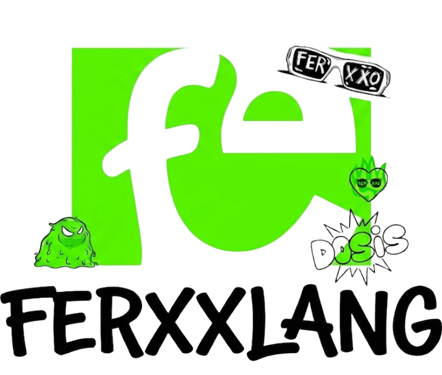

<p align="center">
  
</p>

# FerxxLang

**FerxxLang** es un lenguaje de scripting con vocabulario en argot colombiano diseñado para la construcción modular de scripts científicos. Sus archivos tienen extensión `.fxx`. El analizador léxico y sintáctico está implementado con **Flex** y **Bison** sobre C.

---

## Tabla de contenidos

1. [Requisitos del entorno](#requisitos-del-entorno)
2. [Compilar y ejecutar](#compilar-y-ejecutar)
3. [Vocabulario del lenguaje](#vocabulario-del-lenguaje)
4. [Definición formal del lenguaje](#definición-formal-del-lenguaje)
   - [Expresiones regulares (léxico)](#expresiones-regulares-léxico)
   - [Gramática libre de contexto (BNF)](#gramática-libre-de-contexto-bnf)
5. [Resolución de ambigüedades](#resolución-de-ambigüedades)
6. [Arquitectura modular Flex/Bison](#arquitectura-modular-flexbison)
7. [Casos de prueba no triviales](#casos-de-prueba-no-triviales)
8. [Manejo de errores](#manejo-de-errores)
9. [Información del entorno de desarrollo](#información-del-entorno-de-desarrollo)

---

## Requisitos del entorno

| Herramienta | Versión mínima | Verificar con         |
|-------------|----------------|-----------------------|
| GCC         | 12+            | `gcc --version`       |
| Flex        | 2.6+           | `flex --version`      |
| Bison       | 3.8+           | `bison --version`     |

Instalación en Debian/Ubuntu/Kali:

```bash
sudo apt install flex bison gcc
```

---

## Compilar y ejecutar

```bash
make                         # compila → genera ./ferxxlang
./ferxxlang archivo.fxx      # analiza un archivo
./ferxxlang < archivo.fxx    # alternativa por stdin
make test                    # corre todos los tests
make clean                   # elimina archivos generados
```

El ejecutable imprime `✓ Analisis sintactico exitoso` en stdout si el archivo es válido, o mensajes de error en stderr con el número de línea exacto.

---

## Vocabulario del lenguaje

FerxxLang mapea cada concepto del lenguaje a una palabra en argot colombiano.

### Tipos de dato

| Keyword FerxxLang | Token   | Equivalente convencional |
|-------------------|---------|--------------------------|
| `luka`            | INT     | int                      |
| `vuelto`          | FLOAT   | float                    |
| `firme`           | BOOL    | bool                     |
| `frase`           | STRING  | string                   |
| `combo`           | VECTOR  | vector                   |
| `parche`          | MATRIZ  | matrix                   |
| `fila`            | LIST    | list                     |
| `llave`           | MAP     | map                      |
| `cuadro`          | GRID    | grid                     |
| `parcero`         | CLASS   | class                    |

### Literales booleanos

| Keyword FerxxLang | Valor |
|-------------------|-------|
| `firme_si`        | true  |
| `de_una`          | true  |
| `firme_no`        | false |
| `nel`             | false |

`firme_si` y `de_una` son sinónimos; `firme_no` y `nel` también. Ambos pares producen el mismo token `LIT_BOOL`.

### Control de flujo

| Keyword FerxxLang | Token  | Equivalente |
|-------------------|--------|-------------|
| `si_ve`           | IF     | if          |
| `o_si_no`         | ELSE   | else        |
| `siga_pues`       | WHILE  | while       |
| `dele`            | FOR    | for         |
| `segun`           | SWITCH | switch      |
| `toca`            | CASE   | case        |

### Funciones y entrada/salida

| Keyword FerxxLang | Token  | Equivalente |
|-------------------|--------|-------------|
| `haga`            | FUNC   | function    |
| `vuelva`          | RETURN | return      |
| `diga`            | PRINT  | print       |
| `responda`        | INPUT  | input       |

### Manejo de errores

| Keyword FerxxLang | Token  | Equivalente |
|-------------------|--------|-------------|
| `ensaye`          | TRY    | try         |
| `ojo_pues`        | CATCH  | catch       |
| `paila`           | THROW  | throw       |
| `cuadre`          | ASSERT | assert      |

### Operadores de reducción

| Keyword FerxxLang | Token | Equivalente |
|-------------------|-------|-------------|
| `sume`            | SUM   | sum()       |
| `multiplique`     | PROD  | product()   |
| `el_mas`          | MAX   | max()       |
| `el_menos`        | MIN   | min()       |

### Operadores lógicos

Disponibles en dos formas equivalentes:

| Keyword / Símbolo | Token | Equivalente |
|-------------------|-------|-------------|
| `y_es` / `&&`     | AND   | and / &&    |
| `o_bien` / `\|\|` | OR    | or / \|\|   |
| `no_es` / `!`     | NOT   | not / !     |

### Operadores aritméticos y relacionales

| Símbolo | Token  | Descripción           |
|---------|--------|-----------------------|
| `+`     | PLUS   | suma                  |
| `-`     | MINUS  | resta / negación      |
| `*`     | TIMES  | multiplicación        |
| `/`     | DIV    | división              |
| `%`     | MOD    | módulo                |
| `^`     | POW    | potencia              |
| `=`     | ASSIGN | asignación            |
| `==`    | EQ     | igualdad              |
| `!=`    | NEQ    | desigualdad           |
| `<`     | LT     | menor que             |
| `>`     | GT     | mayor que             |
| `<=`    | LEQ    | menor o igual         |
| `>=`    | GEQ    | mayor o igual         |

---

## Definición formal del lenguaje

### Expresiones regulares (léxico)

Las siguientes expresiones regulares definen los tokens principales del lenguaje. Las macros de Flex usan notación `{nombre}` para reutilizar definiciones:

#### Macros base

| Nombre macro | Expresión regular         | Descripción                                  |
|--------------|---------------------------|----------------------------------------------|
| `DIGITO`     | `[0-9]`                   | Dígito decimal (0–9)                         |
| `LETRA`      | `[a-zA-Z_]`               | Letra mayúscula, minúscula o guión bajo      |
| `ID`         | `{LETRA}({LETRA}\|{DIGITO})*` | Identificador: empieza con letra/_       |
| `LIT_INT`    | `{DIGITO}+`               | Entero: uno o más dígitos                    |
| `LIT_FLOAT`  | `{DIGITO}+\.{DIGITO}+`    | Flotante: dígitos, punto, dígitos            |

#### Tokens principales con sus expresiones regulares

| Categoría         | Expresión regular       | Ejemplos válidos              |
|-------------------|-------------------------|-------------------------------|
| Entero            | `[0-9]+`                | `0`, `42`, `1000`             |
| Flotante          | `[0-9]+\.[0-9]+`        | `3.14`, `0.5`, `99.99`        |
| Cadena (dobles)   | `"[^"]*"`               | `"parcero"`, `"hola mundo"`   |
| Cadena (simples)  | `'[^']*'`               | `'bacano'`, `'ferxxo'`        |
| Identificador     | `[a-zA-Z_][a-zA-Z0-9_]*`| `x`, `mi_var`, `_privado`     |
| Comentario `#`    | `#[^\n]*`               | `# esto es comentario`        |
| Comentario `//`   | `//[^\n]*`              | `// esto también`             |
| Espacios          | `[ \t\n]+`              | espacios, tabs, saltos        |

**Prioridad de reconocimiento — regla de maximal munch:**

Flex aplica siempre la coincidencia más larga posible. Implicaciones clave:

1. **Keywords antes que identificadores:** `luka` → token INT (no ID). `lukax` → ID porque no hay keyword completo de esa longitud.

2. **Operadores de dos caracteres antes que de uno:** `!=` → NEQ (2 chars), no `!` + `=` separados. Lo mismo con `==`, `<=`, `>=`, `&&`, `||`.

3. **Flotantes antes que enteros:** `3.14` → LIT_FLOAT (4 chars). Si el entero tuviera igual longitud que el flotante, Flex elige la primera regla definida — por eso LIT_FLOAT precede a LIT_INT en el archivo.

4. **`$`, `@`, `~`, `\`` y otros caracteres no vocábulario** activan la regla catch-all `.` que emite un error léxico con el número de línea y descarta el carácter.

---

### Gramática libre de contexto (BNF)

La gramática completa de FerxxLang en notación BNF. Los no-terminales usan minúsculas y los terminales en mayúsculas corresponden a los tokens del scanner.

```
programa    ::= lista_sent

lista_sent  ::= ε
             |  lista_sent sentencia

sentencia   ::= declaracion ";"
             |  asignacion ";"
             |  bloque
             |  sentencia_if
             |  sentencia_while
             |  sentencia_for
             |  sentencia_switch
             |  def_funcion
             |  sentencia_try
             |  sentencia_return ";"
             |  sentencia_print ";"
             |  sentencia_input ";"
             |  sentencia_assert ";"
             |  sentencia_throw ";"
             |  llamada_funcion ";"
             |  ";"

declaracion ::= tipo ID
             |  tipo ID "=" expr

tipo        ::= "luka" | "vuelto" | "firme" | "frase"
             |  "combo" | "parche" | "fila" | "llave" | "cuadro" | "parcero"

asignacion  ::= ID "=" expr
             |  ID "[" expr "]" "=" expr

bloque      ::= "{" lista_sent "}"

sentencia_if     ::= "si_ve" "(" expr ")" bloque
                  |  "si_ve" "(" expr ")" bloque "o_si_no" bloque
                  |  "si_ve" "(" expr ")" bloque "o_si_no" sentencia_if

sentencia_while  ::= "siga_pues" "(" expr ")" bloque

sentencia_for    ::= "dele" "(" for_init ";" expr ";" asignacion ")" bloque
                  |  "dele" "(" for_init ";" expr ";" ")" bloque

for_init         ::= declaracion | asignacion

sentencia_switch ::= "segun" "(" expr ")" "{" lista_casos "}"
                  |  "segun" "(" expr ")" "{" "}"

lista_casos      ::= caso | lista_casos caso

caso             ::= "toca" expr ":" lista_sent

def_funcion      ::= "haga" ID "(" lista_params ")" bloque
                  |  "haga" ID "(" ")" bloque

lista_params     ::= param | lista_params "," param

param            ::= tipo ID

sentencia_return ::= "vuelva" expr | "vuelva"

sentencia_print  ::= "diga" "(" expr ")" | "diga" "(" ")"

sentencia_input  ::= "responda" "(" LIT_STRING ")" | "responda" "(" ")"

llamada_funcion  ::= ID "(" lista_args ")" | ID "(" ")"

lista_args       ::= arg | lista_args "," arg

arg              ::= expr | ID ":" expr

sentencia_try    ::= "ensaye" bloque "ojo_pues" "(" ID ")" bloque
                  |  "ensaye" bloque "ojo_pues" "(" tipo ID ")" bloque

sentencia_assert ::= "cuadre" "(" expr ")"
                  |  "cuadre" "(" expr "," LIT_STRING ")"

sentencia_throw  ::= "paila" expr | "paila"

expr             ::= expr "+" expr
                  |  expr "-" expr
                  |  expr "*" expr
                  |  expr "/" expr
                  |  expr "%" expr
                  |  expr "^" expr
                  |  expr "==" expr  |  expr "!=" expr
                  |  expr "<" expr   |  expr ">" expr
                  |  expr "<=" expr  |  expr ">=" expr
                  |  expr ("y_es" | "&&") expr
                  |  expr ("o_bien" | "||") expr
                  |  ("no_es" | "!") expr
                  |  "-" expr
                  |  "(" expr ")"
                  |  ID "[" expr "]"
                  |  ID "." llamada_funcion
                  |  ID "." ID
                  |  llamada_funcion
                  |  ("sume"|"multiplique"|"el_mas"|"el_menos") "(" expr ")"
                  |  "[" lista_exprs "]"
                  |  "[" "]"
                  |  ID | LIT_INT | LIT_FLOAT | LIT_STRING | LIT_BOOL

lista_exprs      ::= expr | lista_exprs "," expr
```

**Nota:** La gramática de `expr` es ambigua por naturaleza (múltiples árboles de parse para `a + b * c`). Esta ambigüedad se resuelve completamente mediante declaraciones de precedencia en Bison, sin necesidad de factorizar la gramática. Ver sección [Resolución de ambigüedades](#resolución-de-ambigüedades).

---

## Resolución de ambigüedades

### 1. Precedencia y asociatividad de operadores

La gramática de `expr` es ambigua: `a + b * c` puede interpretarse como `(a+b)*c` o `a+(b*c)`. En vez de factorizar la gramática en capas de precedencia (expresion → termino → factor → ...), FerxxLang usa la tabla de precedencia de Bison, que es más legible y produce el mismo resultado:

```bison
%nonassoc SIN_ELSE          /* nivel 1 — pseudo-token dangling-else */
%nonassoc ELSE              /* nivel 2 — pseudo-token dangling-else */
%right    ASSIGN            /* nivel 3 — asignacion */
%left     OR                /* nivel 4 — o lógico   */
%left     AND               /* nivel 5 — y lógico   */
%right    NOT               /* nivel 6 — negación   */
%left     EQ NEQ            /* nivel 7 — igualdad   */
%left     LT GT LEQ GEQ     /* nivel 8 — comparación*/
%left     PLUS MINUS        /* nivel 9 — suma/resta */
%left     TIMES DIV MOD     /* nivel 10— mult/div   */
%right    POW               /* nivel 11— potencia   */
%right    UMINUS            /* nivel 12— negación unaria */
```

**Mecanismo:** Cuando Bison tiene un conflicto shift/reduce (regla en la pila vs. token entrante con la misma precedencia), la directiva `%left` → reduce (asociatividad izquierda) y `%right` → shift (asociatividad derecha).

**Ejemplos resueltos:**

| Expresión        | Árbol producido      | Razón                              |
|------------------|----------------------|------------------------------------|
| `a + b + c`      | `(a + b) + c`        | PLUS es `%left` → reduce primero   |
| `a ^ b ^ c`      | `a ^ (b ^ c)`        | POW es `%right` → shift primero    |
| `a + b * c`      | `a + (b * c)`        | TIMES > PLUS en precedencia        |
| `-x ^ 2`         | `-(x ^ 2)`           | UMINUS > POW → se aplica al final  |
| `a && b \|\| c`  | `(a && b) \|\| c`    | OR < AND → AND se reduce primero   |

### 2. Dangling-else (else flotante)

La gramática naïf del `if-else` genera un conflicto shift/reduce clásico:

```
si_ve (a) { si_ve (b) { } o_si_no { } }
```

¿El `o_si_no` pertenece al `si_ve (a)` o al `si_ve (b)` interno?

**Técnica usada:** pseudo-tokens con `%nonassoc`:

```bison
%nonassoc SIN_ELSE   /* precedencia baja */
%nonassoc ELSE       /* precedencia alta */

sentencia_if
    : IF LPAREN expr RPAREN bloque               %prec SIN_ELSE
    | IF LPAREN expr RPAREN bloque ELSE bloque
    | IF LPAREN expr RPAREN bloque ELSE sentencia_if
    ;
```

Cuando el parser tiene `IF bloque .` en la pila y ve `ELSE` en el lookahead:
- Reducir usaría la precedencia `SIN_ELSE` (nivel bajo)
- Hacer shift usaría la precedencia de `ELSE` (nivel alto)
- `ELSE > SIN_ELSE` → **shift gana** → el `ELSE` se une al `IF` más cercano ✓

Resultado: **0 conflictos sin resolver** en `src/sintaxis.output`.

### 3. `throw` con y sin expresión

```bison
sentencia_throw : THROW expr | THROW ;
```

Posible conflicto: después de `THROW`, ¿reducir la alternativa vacía o hacer shift hacia `expr`?

**Análisis:** `FOLLOW(sentencia_throw) = {SEMI}` y `SEMI ∉ FIRST(expr)`. Al ver SEMI después de THROW → siempre reduce la alternativa vacía. Al ver cualquier token de expr → siempre shift. **0 conflictos.**

### 4. Argumento nombrado vs. caso de switch

```bison
arg  : expr | ID COLON expr ;
caso : CASE expr COLON lista_sent ;
```

`ID COLON` aparece en dos contextos distintos. El posible conflicto (¿reducir `expr → ID` o hacer shift hacia `arg → ID COLON`?) se resuelve porque LALR(1) construye **estados separados** para el contexto de `lista_args` (dentro de una llamada a función) y el contexto de `caso` (dentro de switch). En el estado de `lista_args` el shift hacia `arg → ID . COLON expr` está disponible; en el estado de `caso` no existe esa alternativa. **0 conflictos.**

### 5. Acceso a campo vs. llamada de método

```bison
expr : ID DOT ID | ID DOT llamada_funcion ;
```

Después de `ID DOT ID .`, si el lookahead es `LPAREN`, podría tratarse como inicio de una nueva expresión. Sin embargo, `LPAREN ∉ FOLLOW(expr)` — los paréntesis solo aparecen en contextos definidos (condiciones de if/while, argumentos de función, etc.), nunca directamente después de una expresión completa. **0 conflictos.**

---

## Arquitectura modular Flex/Bison

### Componentes del sistema

```
┌─────────────────────────────────────────────────────────────┐
│                      ./ferxxlang archivo.fxx                │
└──────────────────────────────┬──────────────────────────────┘
                               │
               ┌───────────────▼───────────────┐
               │          main()               │
               │    (en sintaxis.tab.c)        │
               │   abre yyin, llama yyparse()  │
               └───────────────┬───────────────┘
                               │ yyparse() llama yylex()
               ┌───────────────▼───────────────┐
               │          yylex()              │
               │    (en lexico.yy.c)           │
               │   generado por Flex           │
               │   lee yyin, devuelve tokens   │
               └───────────────┬───────────────┘
                               │ token (INT, ID, LIT_INT, ...)
               ┌───────────────▼───────────────┐
               │          yyparse()            │
               │    (en sintaxis.tab.c)        │
               │   generado por Bison          │
               │   tablas LALR(1)              │
               │   llama yyerror() si error    │
               └───────────────┬───────────────┘
                               │
               ┌───────────────▼───────────────┐
               │          yyerror()            │
               │    (en sintaxis.tab.c)        │
               │   imprime línea del error     │
               │   activa hubo_error = 1       │
               └───────────────────────────────┘
```

### Flujo de compilación

```bash
# Paso 1: Bison procesa la gramática → genera el parser C y las cabeceras de tokens
bison -d -v src/sintaxis.y -o src/sintaxis.tab.c
# Produce: src/sintaxis.tab.c  (parser LALR)
#          src/sintaxis.tab.h  (definiciones #define de tokens)
#          src/sintaxis.output (reporte de estados y conflictos)

# Paso 2: Flex procesa las reglas léxicas → genera el scanner C
flex -o src/lexico.yy.c src/lexico.l
# Produce: src/lexico.yy.c  (scanner con yylex())
# lexico.l incluye sintaxis.tab.h para tener los valores numéricos de los tokens

# Paso 3: GCC enlaza ambos módulos → ejecutable final
gcc src/sintaxis.tab.c src/lexico.yy.c -o ferxxlang -lfl
# -lfl enlaza libfl (biblioteca de runtime de Flex: yyin, yytext, etc.)
```

### Interacción entre Flex y Bison

**Separación de responsabilidades:**

| Componente | Responsabilidad |
|------------|-----------------|
| `lexico.l` (Flex) | Reconoce patrones de texto → devuelve tokens (números enteros) |
| `sintaxis.y` (Bison) | Acepta secuencias de tokens → valida la estructura gramatical |

**Contrato de comunicación:**

- `yylex()` (Flex) devuelve un entero (el valor del token) y actualiza las variables globales `yytext` (texto del token) y `yylineno` (número de línea).
- `yyparse()` (Bison) llama a `yylex()` cada vez que necesita el siguiente token. La función `yylex()` es completamente transparente para el parser; no importa su implementación interna.
- Cuando `yylex()` devuelve `0`, señala EOF y el parser intenta reducir la regla raíz `programa`.
- Si el parser encuentra un error, llama a `yyerror(mensaje)`, definida en `sintaxis.y`, que usa `yylineno` del scanner para reportar la línea exacta.

**Dependencia de cabeceras:**

`lexico.l` incluye `sintaxis.tab.h` (generado por Bison) para acceder a las constantes `INT`, `FLOAT`, `ID`, etc. Esto crea una dependencia de compilación: Bison debe ejecutarse **antes** que Flex. El Makefile garantiza este orden.

### Variable shadowing — por qué no requiere tabla de símbolos

El parser no mantiene un entorno de nombres. La gramática permite re-declarar cualquier `ID` en cualquier bloque interior:

```
bloque → { lista_sent }
lista_sent → lista_sent sentencia
sentencia → declaracion SEMI
declaracion → tipo ID | tipo ID ASSIGN expr
```

Dado que no hay restricción que prohíba que `ID` en `declaracion` sea igual a un `ID` ya declarado, el parser acepta cualquier re-declaración como válida. El shadowing queda implícito en la estructura de bloques anidados.

---

## Casos de prueba no triviales

Los archivos de prueba en `tests/non-trivial/` cubren las exigencias de LF_Final.md para casos no triviales, con énfasis en estructuras anidadas, recursión, sobrecarga y errores intencionales.

### tests/non-trivial/test_shadowing.fxx — Variable shadowing

**Qué prueba:** Re-declaración del mismo identificador en bloques internos, con y sin cambio de tipo.

**Construcciones incluidas:**
- Shadowing en bloque `if` (nivel 1)
- Shadowing triple anidado (nivel 3 del mismo `x`)
- Cambio de tipo en cascada: `luka x` → `vuelto x` → `frase x`
- Shadowing de variable de control en `while` y `for`
- Shadowing de parámetro formal dentro de la función

**Qué espera el analizador:** `✓ Analisis sintactico exitoso` — el parser no lleva tabla de símbolos, por lo que re-declarar un identificador es siempre sintácticamente válido.

```fxx
# Ejemplo clave: cambio de tipo en cascada
{
    luka x = 1;
    {
        vuelto x = 3.14;   # mismo nombre, tipo diferente
        {
            frase x = "ahora soy frase";  # tercer nivel
        }
    }
}
```

---

### tests/non-trivial/test_recursion.fxx — Invocaciones recursivas

**Qué prueba:** Que la gramática libre de contexto acepta llamadas recursivas en todas sus formas.

**Construcciones incluidas:**
- Recursión directa: factorial (una llamada recursiva), fibonacci (dos llamadas)
- Recursión con acumulador: `fact_acc(n, acc)` — forma de recursión de cola
- Recursión mutua: `es_par` llama a `es_impar` y viceversa (referencia hacia adelante aceptada)
- Recursión con estructura de control interna: potencia por cuadrado rápido (`if` + `*`recursión)
- Recursión dentro de `try/catch`: cada nivel de la recursión tiene su propio manejador
- Función anidada recursiva: `helper` definida dentro de `wrapper` y llamándose a sí misma
- Llamadas recursivas en expresiones complejas: `factorial(5) + fibonacci(6) * potencia(2, 3)`
- Recursión dentro de `for`

**Qué espera el analizador:** `✓ Analisis sintactico exitoso` — la gramática es libre de contexto, por lo que `llamada_funcion → ID (...)` acepta cualquier `ID` como nombre de función, incluyendo el de la función actual.

```fxx
# Ejemplo clave: recursión mutua (forward reference)
haga es_par(luka n) {
    si_ve (n == 0) { vuelva firme_si; }
    vuelva es_impar(n - 1);   # es_impar definida DESPUÉS — OK sintácticamente
}

haga es_impar(luka n) {
    si_ve (n == 0) { vuelva firme_no; }
    vuelva es_par(n - 1);
}
```

---

### tests/non-trivial/test_anidamiento.fxx — Estructuras anidadas

**Qué prueba:** Anidamiento arbitrariamente profundo de todas las estructuras de control.

**Construcciones incluidas:**
- Nivel 4: `for` → `while` → `if` → `if/else` encadenado
- Nivel 3: `if` → `for` → `switch`
- Nivel 3: `while` → `for` → `ensaye/ojo_pues`
- Nivel 5: `función` → `if` → `for` → `ensaye` → `if` → `switch`
- Switch con bloques multisentencia en cada caso (incluyendo `if` y `while` dentro de un caso)
- Expresiones parentéticas de profundidad 4: `(x + (y * (x - (y + 1))))`
- Operadores lógicos compuestos: `(a && b) || (!c && !d)`
- Reductores con expresiones anidadas como argumento: `sume([x*2, y+1, (x+y)*3])`
- Llamada de función como argumento de otra función: `proceso_completo(sume([1,2,3]), es_par(4))`

**Qué espera el analizador:** `✓ Analisis sintactico exitoso` — la gramática no limita la profundidad de anidamiento. Cada `bloque` puede contener cualquier `sentencia`, incluyendo otras sentencias que abran bloques.

```fxx
# Ejemplo clave: 5 niveles de anidamiento
haga proceso_completo(luka n, firme verificar) {
    si_ve (verificar) {                 # nivel 1
        dele (luka i = 0; i < n; ...) { # nivel 2
            ensaye {                    # nivel 3
                si_ve (i % 2 == 0) {   # nivel 4
                    segun (i % 3) {    # nivel 5
                        toca 0: diga("div por 6");
                    }
                }
            } ojo_pues (e) { paila; }
        }
    }
    vuelva n;
}
```

---

### tests/non-trivial/test_overloading.fxx — Sobrecarga de funciones

**Qué prueba:** Que el parser acepta múltiples definiciones `haga` con el mismo nombre.

**Construcciones incluidas:**
- Sobrecarga por tipo del primer parámetro: `procesar(luka)`, `procesar(vuelto)`, `procesar(frase)`, `procesar(firme)`, `procesar(combo)` — 5 variantes
- Sobrecarga por número de parámetros: `combinar(2)`, `combinar(3)`, `combinar(4)` argumentos
- Sobrecarga con tipo compuesto: `transformar(combo)`, `transformar(parche)`, `transformar(fila)`
- Sobrecarga con orden inverso de parámetros: `mezclar(luka, frase)` vs. `mezclar(frase, luka)`
- Sobrecarga donde una variante es recursiva
- Sobrecarga de función anidada (dentro de otra función)
- Llamadas con argumentos nombrados en función sobrecargada

**Qué espera el analizador:** `✓ Analisis sintactico exitoso` — la sobrecarga es **exclusivamente sintáctica**: el parser acepta cualquier número de `def_funcion` con el mismo `ID` porque no hay tabla de símbolos que detecte duplicados.

```fxx
# Ejemplo clave: mismo nombre, 5 tipos diferentes del primer parámetro
haga procesar(luka n)   { vuelva n * 2; }
haga procesar(vuelto f) { vuelva f * 2.0; }
haga procesar(frase s)  { diga(s); vuelva 0; }
haga procesar(firme b)  { si_ve (b) { vuelva 1; } vuelva 0; }
haga procesar(combo v)  { vuelva sume(v); }
```

---

### tests/non-trivial/test_excepciones_completo.fxx — Excepciones completas

**Qué prueba:** Todas las formas del sistema de manejo de excepciones de FerxxLang.

**Construcciones incluidas:**
- `ensaye/ojo_pues` sin tipo en variable catch
- `ensaye/ojo_pues` con tipo `frase` en variable catch
- `ensaye/ojo_pues` con tipo `luka` en variable catch
- `paila` con expresión string, con variable y sin expresión (re-throw)
- `cuadre` sin mensaje: 6 variantes de expresiones lógicas
- `cuadre` con mensaje: 5 variantes
- `try/catch` anidados profundidad 2 (el catch interior re-lanza al exterior)
- `try/catch` anidados profundidad 3
- `try/catch` dentro de función recursiva: cada nivel de recursión tiene su propio manejador
- `try/catch` dentro de `for`, dentro de `while`
- Combinación: `cuadre` + `paila` + `ensaye` dentro de `if`
- `try` con operadores de reducción (`sume`, `el_mas`) sobre literales de colección

**Qué espera el analizador:** `✓ Analisis sintactico exitoso`

```fxx
# Ejemplo clave: try/catch anidados con re-throw
ensaye {
    ensaye {
        paila "error nivel 2";
    } ojo_pues (frase e_inner) {
        paila e_inner;   # re-throw al nivel superior
    }
} ojo_pues (frase e_outer) {
    diga(e_outer);
}
```

---

### tests/non-trivial/test_error_sintactico_01.fxx — Falta punto y coma

**Qué prueba:** Que el parser reporta error con número de línea exacto cuando falta el terminador `;`.

**Error esperado:**
```
Error sintactico en linea 11: syntax error
```

**Explicación:** La declaración `luka z = 40` en línea 10 no tiene `;`. El parser continúa y lee el token `luka` (INT) en la línea 11, cuando esperaba `SEMI`. El error se reporta en la línea donde se encuentra el token inesperado, no donde falta el símbolo.

---

### tests/non-trivial/test_error_sintactico_02.fxx — Bloque sin cerrar

**Qué prueba:** Que el parser detecta EOF inesperado dentro de un bloque anidado sin cerrar.

**Error esperado:**
```
Error sintactico en linea 14: syntax error
```

**Explicación:** La función `funcion_incompleta` abre `{` en línea 9; el `si_ve` interno abre otro `{` en línea 10. Ninguno se cierra. El parser llega al EOF con su pila en estado de espera de `}` y reporta error en la última línea del archivo.

---

### tests/non-trivial/test_error_sintactico_03.fxx — Paréntesis sin cerrar

**Qué prueba:** Que el parser detecta el `)` faltante en una llamada a función.

**Error esperado:**
```
Error sintactico en linea 7: syntax error
```

**Explicación:** La llamada `suma(1, 2` en línea 7 no tiene `)` de cierre. El parser está dentro de `lista_args` esperando `)` o `,`, pero recibe `;`. El error se reporta en la línea del `;` inesperado.

---

### tests/non-trivial/test_error_lexico_01.fxx — Carácter inválido

**Qué prueba:** Que el lexer reporta un carácter no perteneciente al vocabulario con el número de línea exacto, y que el parser reporta el error sintáctico resultante.

**Errores esperados:**
```
Error lexico en linea 10: '$'
Error sintactico en linea 10: syntax error
```

**Explicación:** `$` no coincide con ninguna regla de `lexico.l`; la regla catch-all `.` lo reporta en stderr (con la línea exacta de `yylineno`) y lo descarta. Al descartarlo, el parser recibe `SEMI` cuando esperaba `expr` después de `=`, generando un error sintáctico en la misma línea.

**Diferencia importante:** el error léxico solo activa `fprintf(stderr, ...)` en el lexer — no activa `hubo_error`. El error sintáctico subsiguiente sí activa `hubo_error = 1` y causa exit code 1.

---

## Manejo de errores

### Errores léxicos

Generados por la regla catch-all en `lexico.l`. El carácter inválido se reporta y se descarta; el análisis continúa. No activan `hubo_error`.

```
Error lexico en linea N: 'X'
```

Caracteres que siempre generan error léxico: `@`, `$`, `~`, `` ` ``, `?`, `\`, `#` fuera de comentario al inicio del carácter, entre otros.

### Errores sintácticos

Generados por `yyerror()` en `sintaxis.y`. Activan `hubo_error = 1` → exit code 1. El parser detiene el análisis inmediatamente (sin reglas `error` de recuperación).

```
Error sintactico en linea N: syntax error
```

Causas comunes:
- Falta `;` al final de una declaración o asignación
- Falta `)`, `}`, `]` de cierre
- Tipo no válido en declaración
- `ensaye` sin `ojo_pues`
- Expresión mal formada

---

## Información del entorno de desarrollo

| Campo                     | Valor                          |
|---------------------------|--------------------------------|
| Lenguaje base             | C (estándar C11)               |
| Generador léxico          | Flex 2.6.4                     |
| Generador sintáctico      | Bison 3.8.2                    |
| Compilador                | GCC 14.2.0 (Debian)            |
| Sistema operativo         | Kali Linux (kernel 6.12, x64)  |
| Arquitectura CPU          | x86-64 (AMD64)                 |
| Extensión de archivos     | `.fxx`                         |
| Conflictos shift/reduce   | 0                              |
| Conflictos reduce/reduce  | 0                              |
| Archivos fuente           | 2 (`lexico.l`, `sintaxis.y`)   |
| Tests incluidos           | 11 válidos + 4 de error = 15   |
